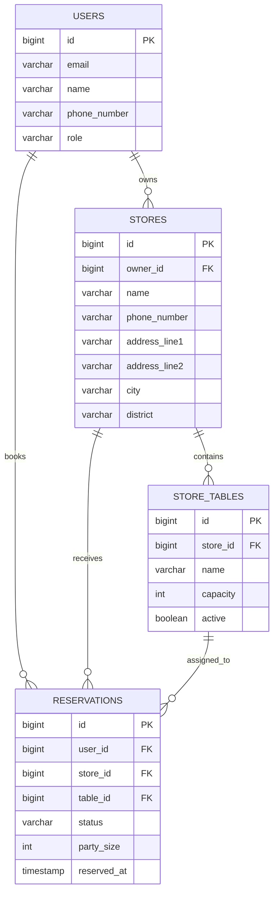

# Catch Table MVP ERD

## Scope

- 사용자는 매장을 조회하고 예약을 생성할 수 있다.
- 매장은 여러 개의 예약 가능한 테이블을 가진다.
- 예약은 특정 매장과 사용자에 속하고, 필요하면 특정 테이블에 배정된다.

## Entities

### `users`

| Column | Type | Description |
| --- | --- | --- |
| `id` | bigint PK | 사용자 ID |
| `email` | varchar(255) unique | 로그인/식별 이메일 |
| `name` | varchar(100) | 사용자 이름 |
| `phone_number` | varchar(30) unique | 연락처 |
| `role` | varchar(20) | `CUSTOMER`, `OWNER`, `ADMIN` |
| `created_at` | timestamp | 생성 시각 |
| `updated_at` | timestamp | 수정 시각 |

### `stores`

| Column | Type | Description |
| --- | --- | --- |
| `id` | bigint PK | 매장 ID |
| `owner_id` | bigint FK -> users.id | 매장 관리자 |
| `name` | varchar(150) | 매장명 |
| `phone_number` | varchar(30) | 매장 연락처 |
| `address_line1` | varchar(255) | 기본 주소 |
| `address_line2` | varchar(255) nullable | 상세 주소 |
| `city` | varchar(100) | 시/도 |
| `district` | varchar(100) | 구/군 |
| `description` | varchar(1000) nullable | 매장 소개 |
| `created_at` | timestamp | 생성 시각 |
| `updated_at` | timestamp | 수정 시각 |

`Store` 엔티티에서는 아래 값을 embedded value object로 묶는다.
- `StoreContact`: `phone_number`
- `StoreAddress`: `address_line1`, `address_line2`, `city`, `district`

### `store_tables`

| Column | Type | Description |
| --- | --- | --- |
| `id` | bigint PK | 테이블 ID |
| `store_id` | bigint FK -> stores.id | 소속 매장 |
| `name` | varchar(50) | 테이블명 또는 번호 |
| `capacity` | integer | 수용 인원 |
| `active` | boolean | 예약 가능 여부 |
| `created_at` | timestamp | 생성 시각 |
| `updated_at` | timestamp | 수정 시각 |

### `reservations`

| Column | Type | Description |
| --- | --- | --- |
| `id` | bigint PK | 예약 ID |
| `user_id` | bigint FK -> users.id | 예약자 |
| `store_id` | bigint FK -> stores.id | 예약 매장 |
| `table_id` | bigint FK -> store_tables.id nullable | 배정 테이블 |
| `status` | varchar(20) | `PENDING`, `CONFIRMED`, `SEATED`, `COMPLETED`, `CANCELED`, `NO_SHOW` |
| `party_size` | integer | 방문 인원 |
| `reserved_at` | timestamp | 예약 일시 |
| `request_note` | varchar(500) nullable | 요청사항 |
| `canceled_at` | timestamp nullable | 취소 시각 |
| `seated_at` | timestamp nullable | 착석 시각 |
| `created_at` | timestamp | 생성 시각 |
| `updated_at` | timestamp | 수정 시각 |

## Relationships

- `users` 1 : N `stores`
- `users` 1 : N `reservations`
- `stores` 1 : N `store_tables`
- `stores` 1 : N `reservations`
- `store_tables` 1 : N `reservations`

## Mermaid

